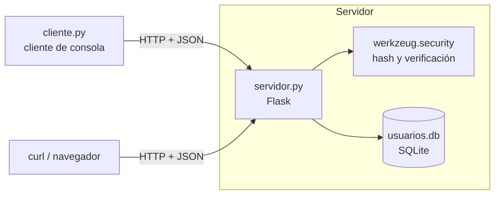
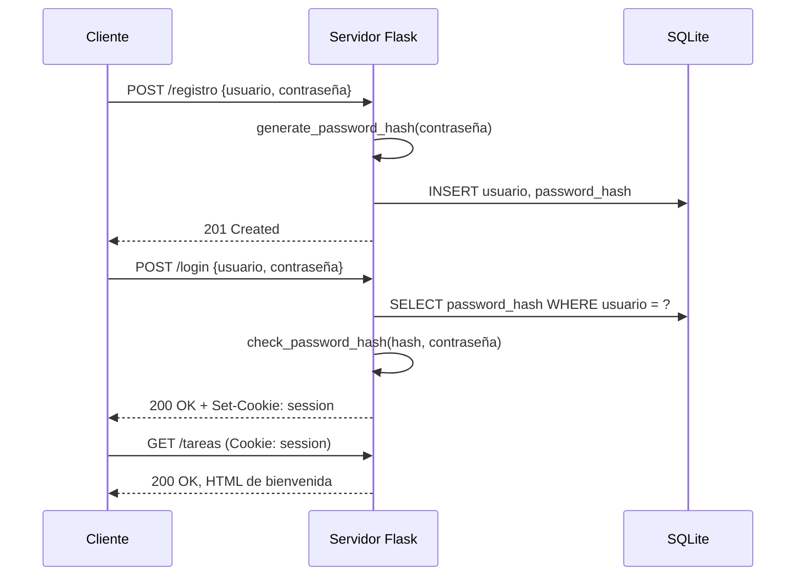
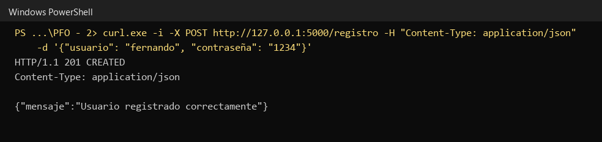
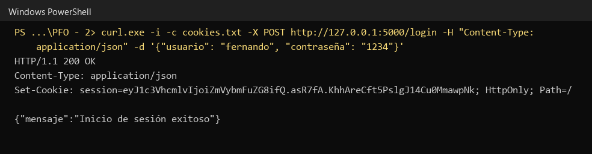
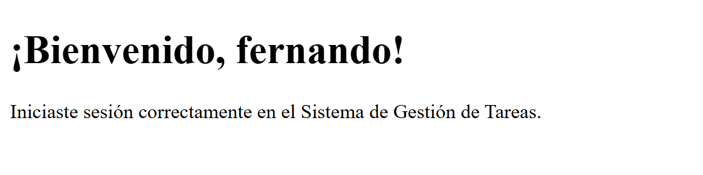
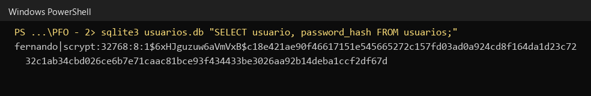
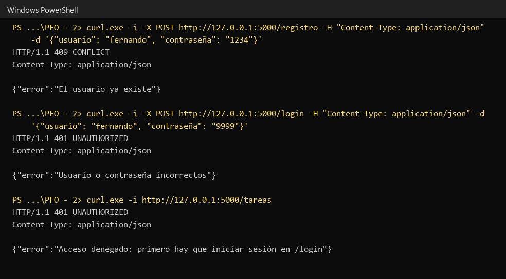
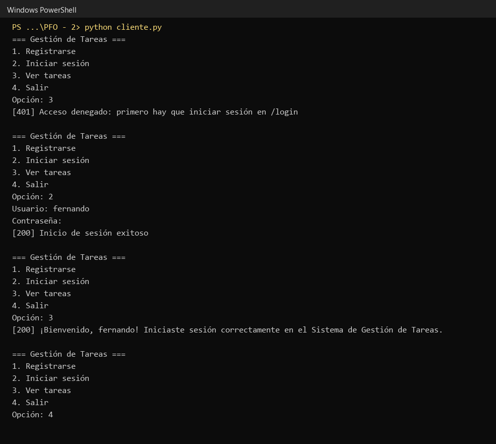
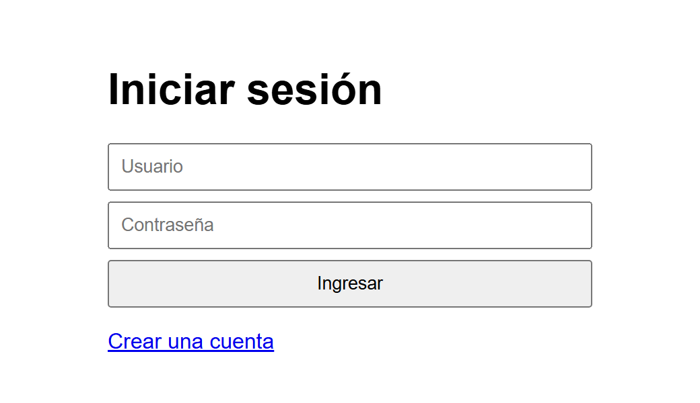
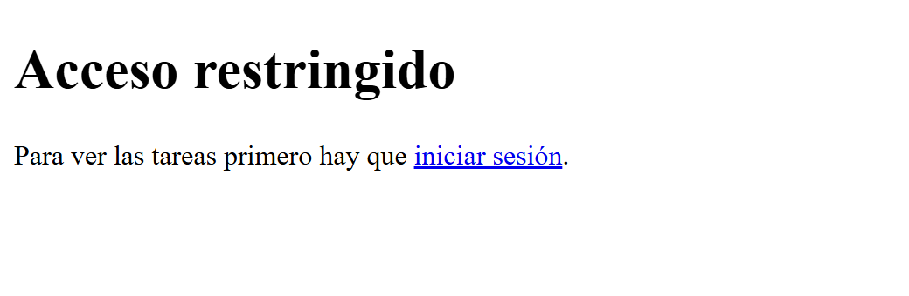

# PFO 2: Sistema de Gestión de Tareas con API y Base de Datos

**Programación sobre Redes** · Tecnicatura Superior en Desarrollo de Software · IFTS N.° 29
Alumno: Fernando Rodriguez · 5.° Cuatrimestre · 2026

Documentación publicada: https://ferchulobo777.github.io/pfo2-gestion-tareas/

## Tabla de contenidos

1. [Descripción](#descripción)
2. [Funcionalidades](#funcionalidades)
3. [Arquitectura](#arquitectura)
4. [Tecnologías](#tecnologías)
5. [Instalación](#instalación)
6. [Ejecución](#ejecución)
7. [Documentación de la API](#documentación-de-la-api)
8. [Cliente de consola](#cliente-de-consola)
9. [Modelo de datos](#modelo-de-datos)
10. [Seguridad](#seguridad)
11. [Pruebas](#pruebas)
12. [Estructura del proyecto](#estructura-del-proyecto)
13. [Respuestas conceptuales](#respuestas-conceptuales)
14. [Limitaciones y mejoras posibles](#limitaciones-y-mejoras-posibles)

## Descripción

API REST desarrollada con Flask que permite registrar usuarios, iniciar sesión y acceder a una página de bienvenida (`/tareas`) disponible solo para usuarios autenticados. Los usuarios se persisten en una base SQLite y las contraseñas se almacenan como hash con sal, nunca en texto plano. El proyecto incluye además un cliente de consola que consume la API mediante HTTP y JSON.

Consigna de la cátedra: implementar una API REST con endpoints funcionales, autenticación básica con protección de contraseñas, persistencia en SQLite y un cliente de consola que interactúe con la API.

## Funcionalidades

- Registro de usuarios con validación de los datos recibidos y restricción de nombre único.
- Almacenamiento de contraseñas con `generate_password_hash` (scrypt con sal aleatoria).
- Inicio de sesión que verifica el hash y abre una sesión mediante una cookie firmada.
- Ruta `/tareas` protegida: responde 401 sin sesión y devuelve un HTML de bienvenida con sesión iniciada.
- Formularios HTML en `/registro` y `/login` (método GET) para usar la API desde el navegador, y redirección de `/` al login. Un navegador que pide `/tareas` sin sesión recibe una página con el enlace al login.
- Códigos de estado HTTP coherentes (201, 200, 400, 401, 409, 500) y respuestas de error en JSON.
- Detección de puerto ocupado antes de iniciar el servidor.
- Cliente de consola con menú, manejo de servidor caído y lectura de la contraseña sin eco.

## Arquitectura



Flujo de autenticación y acceso a `/tareas`:



## Tecnologías

| Componente | Uso |
|---|---|
| Python 3.9 o superior | Lenguaje del servidor y del cliente |
| Flask | Framework web y enrutamiento de la API |
| werkzeug.security | Hash y verificación de contraseñas (se instala junto con Flask) |
| sqlite3 | Persistencia de los usuarios (módulo de la biblioteca estándar) |
| requests | Pedidos HTTP del cliente de consola |
| GitHub Pages | Publicación de la documentación desde `docs/` |

## Instalación

```bash
git clone https://github.com/Ferchulobo777/pfo2-gestion-tareas.git
cd pfo2-gestion-tareas
python -m venv venv
```

Activar el entorno virtual:

```
# Windows
venv\Scripts\activate

# Linux o macOS
source venv/bin/activate
```

Instalar las dependencias:

```
pip install -r requirements.txt
```

## Ejecución

1. Iniciar el servidor:

```
python servidor.py
```

Debe mostrar `Running on http://127.0.0.1:5000`. Al iniciar crea el archivo `usuarios.db` y la tabla `usuarios` si todavía no existen. Si el puerto 5000 está ocupado, el servidor informa el error y no inicia.

2. En otra terminal (con el entorno virtual activado), iniciar el cliente:

```
python cliente.py
```

3. Uso desde el navegador: abrir http://127.0.0.1:5000/ (redirige al login). El flujo es: crear una cuenta en `/registro`, iniciar sesión en `/login` y ver la bienvenida en `/tareas`.

Variable opcional: `SECRET_KEY` define la clave con la que se firma la cookie de sesión. Si no se define, se genera una aleatoria al iniciar y las sesiones se pierden al reiniciar el servidor.

```
# Windows (PowerShell)
$env:SECRET_KEY = "clave-larga-y-aleatoria"

# Linux o macOS
export SECRET_KEY="clave-larga-y-aleatoria"
```

## Documentación de la API

Base URL: `http://127.0.0.1:5000`. Las solicitudes con cuerpo usan `Content-Type: application/json`.

### POST /registro

Crea un usuario y guarda su contraseña como hash.

Cuerpo:

```json
{"usuario": "fernando", "contraseña": "1234"}
```

| Código | Cuerpo | Cuándo |
|---|---|---|
| 201 | `{"mensaje": "Usuario registrado correctamente"}` | Registro correcto |
| 400 | `{"error": "Se espera un JSON con \"usuario\" y \"contraseña\" no vacíos"}` | Cuerpo que no es JSON, campos ausentes, vacíos o que no son texto |
| 409 | `{"error": "El usuario ya existe"}` | Nombre de usuario repetido |
| 500 | `{"error": "Error del servidor al guardar el usuario"}` | Falla de la base de datos |

### POST /login

Verifica las credenciales e inicia la sesión. En caso de éxito la respuesta incluye la cookie `session`.

Cuerpo: igual que en `/registro`.

| Código | Cuerpo | Cuándo |
|---|---|---|
| 200 | `{"mensaje": "Inicio de sesión exitoso"}` y `Set-Cookie: session=...; HttpOnly; Path=/` | Credenciales correctas |
| 400 | `{"error": "Se espera un JSON con ..."}` | Datos inválidos |
| 401 | `{"error": "Usuario o contraseña incorrectos"}` | Usuario inexistente o contraseña incorrecta (mismo mensaje en ambos casos) |
| 500 | `{"error": "Error del servidor al consultar el usuario"}` | Falla de la base de datos |

### GET /tareas

Devuelve el HTML de bienvenida. Requiere la cookie de sesión obtenida en `/login`.

| Código | Cuerpo | Cuándo |
|---|---|---|
| 200 | HTML con `¡Bienvenido, <usuario>!` | Sesión iniciada |
| 401 | `{"error": "Acceso denegado: primero hay que iniciar sesión en /login"}` | Sin sesión, cliente que no es un navegador (curl, requests) |
| 401 | Página HTML "Acceso restringido" con enlace a `/login` | Sin sesión, navegador (la cabecera `Accept` incluye `text/html`) |

### Rutas para el navegador

| Método | Ruta | Respuesta |
|---|---|---|
| GET | `/` | Redirección 302 a `/login` |
| GET | `/login` | Formulario HTML de inicio de sesión; envía los datos como JSON a `POST /login` y, si son correctos, redirige a `/tareas` |
| GET | `/registro` | Formulario HTML de registro; envía los datos como JSON a `POST /registro` y, si son correctos, redirige a `/login` |

### Ejemplos con curl

En Windows se usa `curl.exe` (en PowerShell `curl` es un alias de otro comando).

```
curl.exe -i -X POST http://127.0.0.1:5000/registro -H "Content-Type: application/json" -d "{\"usuario\": \"fernando\", \"contraseña\": \"1234\"}"

curl.exe -i -c cookies.txt -X POST http://127.0.0.1:5000/login -H "Content-Type: application/json" -d "{\"usuario\": \"fernando\", \"contraseña\": \"1234\"}"

curl.exe -b cookies.txt http://127.0.0.1:5000/tareas
```

En Linux o macOS:

```
curl -i -X POST http://127.0.0.1:5000/registro -H "Content-Type: application/json" -d '{"usuario": "fernando", "contraseña": "1234"}'

curl -i -c cookies.txt -X POST http://127.0.0.1:5000/login -H "Content-Type: application/json" -d '{"usuario": "fernando", "contraseña": "1234"}'

curl -b cookies.txt http://127.0.0.1:5000/tareas
```

La opción `-c` guarda la cookie de sesión y `-b` la envía en el pedido siguiente.

## Cliente de consola

`cliente.py` presenta un menú con cuatro opciones: registrarse, iniciar sesión, ver tareas y salir. Usa `requests.Session`, que conserva la cookie recibida en el login y la reenvía en los pedidos siguientes. La contraseña se lee con `getpass`, por lo que no se muestra al escribirla. Si el servidor no está disponible o no responde dentro de 5 segundos, informa el error y vuelve al menú.

## Modelo de datos

Base SQLite `usuarios.db`, tabla `usuarios`:

| Campo | Tipo | Restricciones | Descripción |
|---|---|---|---|
| id | INTEGER | PRIMARY KEY AUTOINCREMENT | Identificador |
| usuario | TEXT | NOT NULL, UNIQUE | Nombre de usuario |
| password_hash | TEXT | NOT NULL | Hash de la contraseña calculado con `werkzeug.security` |
| fecha_registro | TEXT | NOT NULL | Fecha y hora del registro (`AAAA-MM-DD HH:MM:SS`) |

Formato del hash almacenado: `scrypt:32768:8:1$<sal>$<hash>`, donde 32768, 8 y 1 son los parámetros N, r y p del algoritmo.

## Seguridad

| Medida | Implementación |
|---|---|
| Contraseñas hasheadas | `generate_password_hash` con scrypt y sal aleatoria por usuario |
| Verificación | `check_password_hash` sobre el hash guardado; nunca se compara texto plano |
| Inyección SQL | Todas las consultas usan parámetros (`?`) |
| XSS | El nombre de usuario se escapa con `escape()` al construir el HTML de `/tareas` |
| Enumeración de usuarios | `/login` devuelve el mismo mensaje si falla el usuario o la contraseña |
| Sesión | Cookie firmada con `secret_key`, con el atributo HttpOnly (no accesible desde JavaScript) |
| Validación de entrada | Se exige un JSON con `usuario` y `contraseña` de tipo texto y no vacíos |
| Conexiones a la base | Una conexión por pedido, cerrada al finalizar, porque `sqlite3` no comparte conexiones entre hilos |
| Puerto ocupado | Se prueba el puerto con un socket común antes de iniciar. El servidor de desarrollo de Flask usa `SO_REUSEADDR`, que en Windows permite que dos procesos escuchen el mismo puerto sin error |

## Pruebas

Las pruebas se ejecutaron contra el servidor real (`127.0.0.1:5000`) con Python 3.9, Flask 3.1 y SQLite 3.44, en Windows 11. Se realizaron 67 casos automatizados contra el servidor en ejecución y un recorrido completo manual en un navegador. Todos dieron el resultado esperado.

| Categoría | Casos | Qué se verifica |
|---|---|---|
| Funcionalidad de la API | 7 | Registro (201), usuario repetido (409), login correcto (200), contraseña incorrecta y usuario inexistente (401), `/tareas` con y sin sesión |
| Validación de entradas y rutas | 16 | Cuerpo que no es JSON, JSON malformado, lista o nulos, campos ausentes, vacíos o que no son texto, espacios en el nombre, `Content-Type` incorrecto, usuario de 5000 caracteres, métodos no permitidos (405) y rutas inexistentes (404) |
| Caracteres especiales y datos extremos | 4 | Acentos, ñ y emoji en usuario y contraseña, contraseña de 100000 caracteres |
| Seguridad | 14 | Inyección SQL (4 variantes en login y una en registro), integridad de la tabla, XSS en el nombre, cookie adulterada, inventada o basura, cookie legítima, atributo HttpOnly, hash almacenado sin texto plano |
| Navegador y formularios | 8 | `/` redirige a `/login`, formularios de login y registro, página de acceso restringido para navegadores y JSON para otros clientes, cabecera `Accept` real de Chrome |
| Concurrencia | 2 | 25 registros simultáneos del mismo usuario: exactamente un 201, 24 respuestas 409 y una sola fila en la base |
| Persistencia y sesión | 4 | Los usuarios persisten al reiniciar el servidor; la sesión sigue válida con la misma `SECRET_KEY` y deja de serlo con otra |
| Errores de infraestructura | 4 | Segundo servidor con el puerto ocupado, base de datos inaccesible al iniciar (mensaje claro, sin traceback), tabla inexistente en funcionamiento (500 en JSON) |
| Cliente de consola | 8 | Registro, usuario repetido, login incorrecto y correcto, ver tareas, opción inválida, usuario vacío, servidor caído |

Recorrido manual en el navegador: `/tareas` sin sesión muestra la página de acceso restringido, el enlace lleva a `/login`, desde ahí se abre `/registro`, se crea un usuario, se prueba una contraseña incorrecta (el formulario muestra el error), se inicia sesión con la contraseña correcta y se llega a la bienvenida en `/tareas`.

Para ver el hash almacenado:

```
sqlite3 usuarios.db "SELECT usuario, password_hash FROM usuarios;"
```

### Capturas

Registro de usuario (201):



Inicio de sesión (200) con la cookie de sesión:



Página de bienvenida en `/tareas` con la sesión iniciada:



Contraseña almacenada como hash en SQLite:



Respuestas de error (409 y 401):



Sesión completa con el cliente de consola:



Formulario de inicio de sesión en el navegador:



Acceso a `/tareas` sin sesión desde un navegador:



## Estructura del proyecto

| Ruta | Contenido |
|---|---|
| `servidor.py` | API Flask con SQLite (registro, login y tareas) |
| `cliente.py` | Cliente de consola que consume la API |
| `requirements.txt` | Dependencias |
| `README.md` | Documentación del proyecto |
| `.gitignore` | Archivos excluidos del repositorio |
| `usuarios.db` | Base SQLite (se crea al iniciar el servidor, no se versiona) |
| `docs/index.html` | Sitio publicado con GitHub Pages |
| `docs/capturas/` | Capturas de las pruebas |

## Respuestas conceptuales

### ¿Por qué hashear contraseñas?

Porque la base de datos puede filtrarse por una vulnerabilidad, un backup mal protegido o el acceso de una persona no autorizada. Si las contraseñas estuvieran en texto plano, quien obtenga la base tendría de inmediato las credenciales de todos los usuarios y, como muchas personas repiten la misma contraseña en varios servicios, también podría ingresar a esas otras cuentas.

Un hash es una función de un solo sentido: a partir de la contraseña se calcula el hash, pero no se puede recorrer el camino inverso. Para validar un login, el servidor calcula el hash de lo que escribió el usuario y lo compara con el hash guardado, sin necesidad de conocer ni almacenar la contraseña original.

Además, las librerías actuales agregan una sal aleatoria a cada contraseña, lo que evita que contraseñas iguales produzcan el mismo hash e inutiliza las tablas precalculadas (rainbow tables). También usan algoritmos lentos a propósito (scrypt, bcrypt, PBKDF2), que encarecen los ataques de fuerza bruta. El hash no impide que la base se filtre, pero reduce mucho el daño cuando eso ocurre.

### Ventajas de usar SQLite en este proyecto

- No necesita un servidor de base de datos: es una base embebida que se guarda en un único archivo.
- El módulo `sqlite3` viene incluido en Python, por lo que no se instala nada adicional.
- No requiere configuración: la base y la tabla se crean al iniciar el servidor, y cualquiera puede clonar el repositorio y probarlo.
- Es portable: todo está en un archivo que se copia, respalda o elimina fácilmente.
- Los datos persisten cuando se reinicia el servidor, a diferencia de guardarlos en memoria.
- Usa SQL estándar y soporta transacciones, lo que permite restricciones como `UNIQUE` sobre el usuario y consultas parametrizadas.
- Es suficiente para la escala del proyecto, con pocos usuarios y poca concurrencia. Con muchos usuarios escribiendo a la vez convendría migrar a un motor cliente servidor como PostgreSQL o MySQL.

## Limitaciones y mejoras posibles

- Servir la API por HTTPS (TLS) y configurar la cookie con los atributos `Secure` y `SameSite`. En el estado actual el tráfico viaja sin cifrar, por lo que el uso queda limitado al entorno local.
- Limitar los intentos de login por usuario o por IP para dificultar los ataques de fuerza bruta.
- Definir una política de contraseñas (longitud mínima y complejidad) en `/registro`.
- Agregar un endpoint de cierre de sesión (`/logout`) y protección CSRF si se incorporan formularios.
- Ejecutar con un servidor WSGI (waitress o gunicorn) en lugar del servidor de desarrollo de Flask.
- Implementar la gestión de tareas propiamente dicha (alta, consulta, modificación y baja por usuario). La consigna solo pide la página de bienvenida en `/tareas`.
- Agregar pruebas automatizadas (`pytest` con el cliente de pruebas de Flask).
